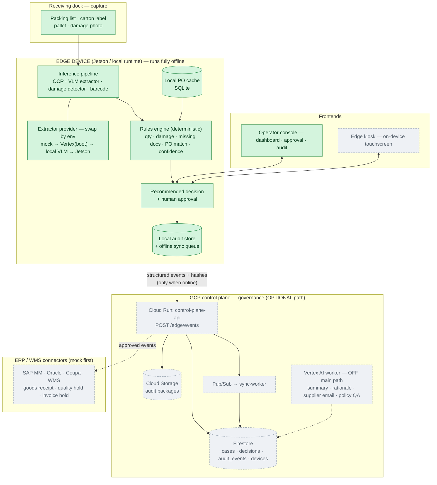
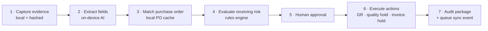

# Architecture — Edge Receiving Control Agent

> Local AI turns dock evidence into governed, auditable P2P decisions.
> **Edge-first: the cloud is an optional path.** No network → the edge still
> recognizes, decides, approves, and keeps an audit record. With network → only
> structured events + evidence **hashes** sync up; raw images never leave the device.

**Legend:** 🟢 green = built (P1, runs today) · ⬜ dashed = planned (P3–P8).

---

## 1. System architecture



---

## 2. The closed loop (one receiving case)



Hero case (built, verified): BASF · Heidelberg · PO 45009281 · ordered 40 ·
detected 42 · 2 damaged · missing batch certificate → **partial receipt + invoice
hold** (PO-match 95, exception EXC-0041).

---

## 3. Operating modes

| Mode | Network | Extraction | Decision | What syncs to cloud |
|------|---------|------------|----------|---------------------|
| **Offline edge** | none | on-device | local rules + human | nothing (queued) |
| **Cloud sync** | online | on-device | local rules + human | structured events + hashes |
| **Vertex enhanced** | online | on-device | local rules + human | events + optional Vertex summaries/email |

The decision path is identical in all three modes. Vertex AI only ever *explains*
— it never decides whether to receive goods.

---

## 4. Pluggable extractor — same interface, four backends

| Phase | Provider | Where it runs | Status |
|-------|----------|---------------|--------|
| P1 | `mock` | edge, no deps | ✅ built |
| P3 | `vertex` | Vertex AI Gemini (bootstrap) | ⬜ planned |
| P5 | `local` | on-device VLM (Ollama / Qwen2-VL) | ⬜ planned |
| P7 | `jetson` | Jetson TensorRT (OCR + YOLO damage) | ⬜ planned |

Set `INFER_PROVIDER`; nothing else in the loop changes.

---

## 5. Build status (roadmap)

| Phase | Scope | Status |
|-------|-------|--------|
| P1 | Edge-runtime closed loop (mock) + rules-engine + audit | ✅ done |
| P2 | Wire `frontend/` to the edge API | next |
| P3 | Vertex bootstrap extractor | planned |
| P4 | GCP control plane (Cloud Run + Firestore + `/edge/events` sync) | planned |
| P5 | Local VLM extractor (offline extraction) | planned |
| P6 | Vertex enhancement worker | planned |
| P7 | Jetson + camera + TensorRT | planned |
| P8 | Mock ERP connector (SAP MM) | planned |

---

## 6. Repo map

```
frontend/                      Vite + React operator console
backend/
  services/
    edge-runtime/   ✅ runtime/{inference, local_store, local_api, sync, utils}
    rules-engine/   ✅ deterministic findings → evaluation
    audit/          ✅ hashing · decision trace · package · slim sync event
    api/            ⬜ control-plane-api (Cloud Run + Firestore)
    vertex-ai-worker/ ⬜ enhancement layer
    connectors/     ⬜ mock SAP/Oracle/Coupa/WMS
  cloud/gcp/        ⬜ terraform · cloud-run · firestore · storage · vertex
  infra/            ⬜ docker · systemd · jetson
docs/               this file + product/demo/roi/api specs
```
